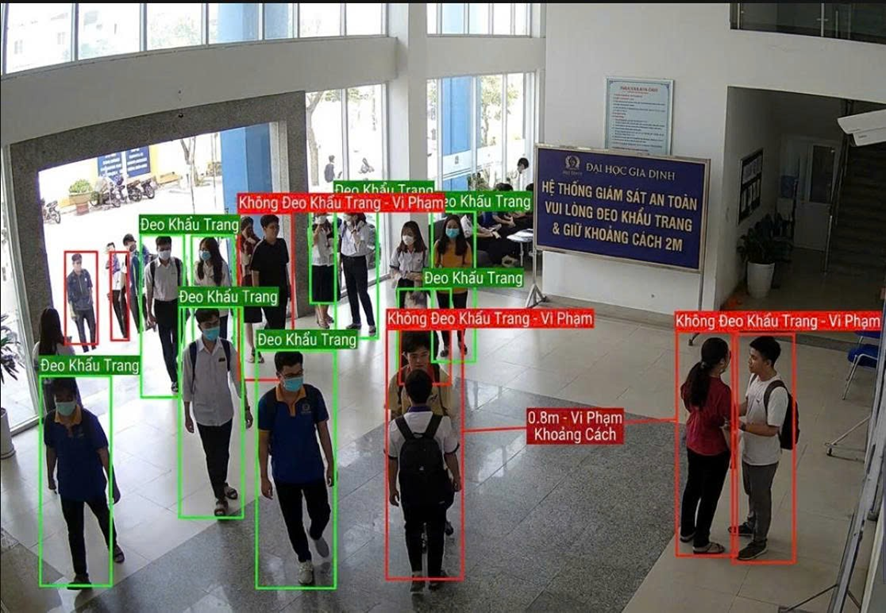
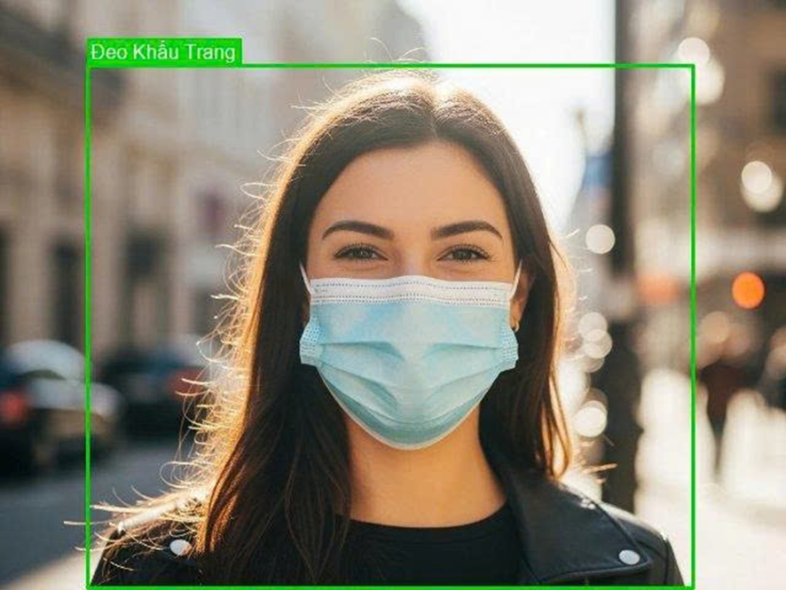
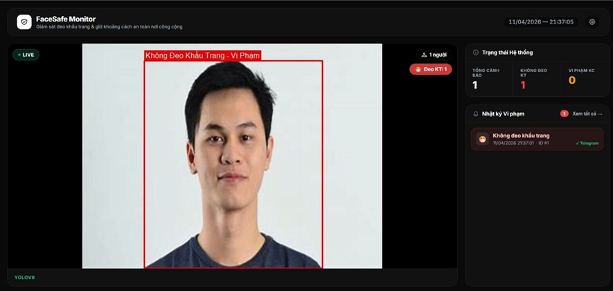
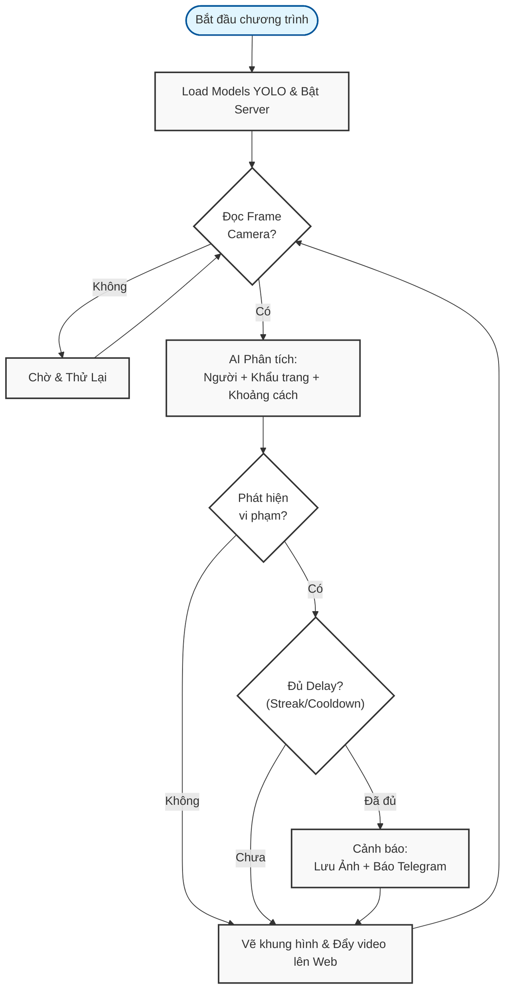

# 😷 FaceSafe Monitor

<div align="center">
  
  <p><i>Hệ thống giám sát an toàn công cộng thông minh dựa trên AI - Phát hiện khẩu trang & Khoảng cách xã hội</i></p>
</div>

> **FaceSafe Monitor** — Giải pháp tự động hóa giám sát an toàn nơi công cộng. Sử dụng sức mạnh của YOLOv8 để phát hiện vi phạm đeo khẩu trang và duy trì khoảng cách an toàn, đồng thời gửi cảnh báo tức thì qua Telegram.

---

## 📸 Demo Kết quả

### 1. Giám sát Tổng quát
<div align="center">
  
  <br><i>Hệ thống theo dõi đồng thời nhiều đối tượng, xác định trạng thái đeo khẩu trang và đo khoảng cách chính xác.</i>
</div>

### 2. Chi tiết Nhận diện
<div align="center">
  <table border="0">
    <tr>
      <td align="center">
        <br>
        <i><b>Hợp lệ:</b> Đang đeo khẩu trang</i>
      </td>
      <td align="center">
        <br>
        <i><b>Vi phạm:</b> Không đeo khẩu trang</i>
      </td>
    </tr>
  </table>
</div>

### 3. Giao diện Dashboard Điều khiển
<div align="center">
  
  <br><i>Giao diện web trực quan hiển thị video stream thời gian thực, bảng nhật ký vi phạm và thống kê hệ thống.</i>
</div>

---

**📌 Nguyên lý hoạt động cơ bản:**
- **Lớp Nhận diện (AI Layer):** Dùng YOLOv8n kết hợp ByteTrack để tìm và theo dõi ID người. Dùng YOLOv8m-FMD để phát hiện khẩu trang. Ghép nối dữ liệu qua thuật toán IOU Head để gán nhãn chính xác cho từng cá nhân.
- **Lớp Xử lý (Decision Layer):** Phân tích hành vi dựa trên chuỗi frame liên tiếp (Streak). Chỉ phát hành cảnh báo khi vi phạm được xác nhận ổn định, tránh tình trạng báo động giả do nhiễu vật lý.

---

## 📋 Mục lục

- [Tính năng](#-tính-năng)
- [Kiến trúc hệ thống](#-kiến-trúc-hệ-thống)
- [Lưu đồ hoạt động](#-lưu-đồ-hoạt-động)
- [Cấu trúc thư mục](#-cấu-trúc-thư-mục)
- [Cài đặt & Chạy](#-cài-đặt--chạy)
- [Cấu hình](#-cấu-hình)
- [API Reference](#-api-reference)

---

## ✨ Tính năng

| Tính năng | Mô tả |
|-----------|-------|
| 🎯 Phát hiện khẩu trang | YOLOv8 nhận diện `mask` / `no_mask` theo thời gian thực |
| 📏 Khoảng cách xã hội | Đo khoảng cách (pixel → mét) giữa các cặp người |
| 🔔 Cảnh báo Telegram | Gửi ảnh bằng chứng + thông tin vi phạm tự động |
| 📺 Live Stream | Video MJPEG có bounding box tiếng Việt trực tiếp trên web |
| 📊 Dashboard thời gian thực | SSE cập nhật số liệu không cần reload trang |
| 📂 Lịch sử vi phạm | Lưu ảnh `.jpg`, xem lại toàn bộ bằng chứng |
| ⚙️ Cài đặt trực tuyến | Chỉnh ngưỡng, cooldown, Token Telegram qua UI |

---

## 🏗 Kiến trúc hệ thống

```
┌─────────────────────────────────────────────────────┐
│                    PYTHON BACKEND                   │
│                                                     │
│  Camera → [YOLOv8 Person] → [YOLOv8 Mask]         │
│              ↓                    ↓                 │
│         ByteTrack ID         mask/no_mask           │
│              └──────────┬────────┘                  │
│                   Render PIL (VN font)              │
│                         ↓                          │
│              MJPEG Stream (/api/stream)             │
│              SSE Events  (/api/alerts)              │
│                                                     │
│  FastAPI  ←→  router.py  ←→  telegram_utils.py     │
└─────────────────────────────────────────────────────┘
                         ↕ HTTP / SSE
┌─────────────────────────────────────────────────────┐
│                   WEB FRONTEND (UI/)                │
│                                                     │
│      ←  Video Live            │
│   EventSource(/api/alerts) ← Số liệu realtime      │
│   Dashboard / Alert Log / History Popup             │
└─────────────────────────────────────────────────────┘
```

---

## 🔄 Lưu đồ hoạt động




---

## 📁 Cấu trúc thư mục

```
face/
├── main.py            # Core: vòng lặp camera, detect, render, stream
├── router.py          # FastAPI routes: stream, SSE, config, history
├── config.py          # Hằng số cấu hình (ngưỡng, đường dẫn, màu)
├── telegram_utils.py  # Gửi ảnh & text qua Telegram Bot API
├── requirements.txt   # Thư viện Python cần thiết
├── settings.json      # Cài đặt runtime (tự sinh, có thể sửa)
├── yolov8.pt          # Model phát hiện người (YOLOv8n)
├── YOLOv8m_FMD.pt     # Model phát hiện khẩu trang (YOLOv8m)
├── alerts/            # Thư mục lưu ảnh bằng chứng vi phạm
└── UI/
    ├── index.html     # Giao diện dashboard chính
    ├── app.js         # Logic: SSE, AlertManager, Settings, History
    ├── style.css      # Dark theme, layout, components
    └── alerts-popup.css  # Popup lịch sử vi phạm
```

---

## 🚀 Cài đặt & Chạy

### 1. Cài thư viện

```bash
pip install -r requirements.txt
```

### 2. Chuẩn bị model

Đặt 2 file model vào thư mục gốc:
- `yolov8.pt` — phát hiện người
- `YOLOv8m_FMD.pt` — phát hiện khẩu trang

### 3. Cấu hình Telegram *(tùy chọn)*

Chỉnh trong `config.py` hoặc qua UI sau khi chạy:

```python
TELEGRAM_TOKEN   = "YOUR_BOT_TOKEN"
TELEGRAM_CHAT_ID = "YOUR_CHAT_ID"
```

### 4. Chạy server

```bash
python main.py
```

### 5. Mở trình duyệt

```
http://localhost:8001
```

---

## ⚙️ Cấu hình

Các thông số trong `config.py` (hoặc chỉnh trực tiếp trên UI):

| Tham số | Mặc định | Ý nghĩa |
|---------|----------|---------|
| `CONFIRM_FRAMES` | `5` | Số frame `no_mask` liên tiếp để xác nhận vi phạm |
| `DISTANCE_THRESHOLD` | `120 px` | Khoảng cách chân < ngưỡng → vi phạm khoảng cách |
| `MASK_COOLDOWN` | `30 s` | Thời gian chờ giữa 2 cảnh báo khẩu trang |
| `DIST_COOLDOWN` | `20 s` | Thời gian chờ giữa 2 cảnh báo khoảng cách |
| `PIXELS_PER_METER` | `150 px` | Hệ số quy đổi pixel → mét (chỉnh theo camera) |
| `CAMERA_SOURCE` | `0` | Index webcam (0 = camera mặc định) |

---

## 🛠 Công nghệ sử dụng

| Thành phần | Công nghệ |
|-----------|-----------|
| AI / Detection | [Ultralytics YOLOv8](https://github.com/ultralytics/ultralytics) |
| Object Tracking | ByteTrack (tích hợp trong Ultralytics) |
| Backend | FastAPI + Uvicorn |
| Video Render | OpenCV + Pillow (font tiếng Việt) |
| Frontend | Vanilla HTML / CSS / JavaScript |
| Realtime | MJPEG Stream + Server-Sent Events (SSE) |
| Notification | Telegram Bot API |

---

## 📌 Lưu ý

- **Cooldown kép**: mỗi cảnh báo có 2 lớp cooldown — `per-ID` (theo từng người) và `global` (toàn hệ thống) để tránh spam khi tracker đổi ID.
- **Khoảng cách**: đo theo `foot point` (điểm giữa đáy bbox), không phải tâm box.
- **Font tiếng Việt**: dùng `arial.ttf` từ Windows Fonts — render qua PIL để hiển thị đúng ký tự có dấu.
- `settings.json` được sinh tự động khi lưu cài đặt qua UI, ưu tiên hơn `config.py`.

---

<div align="center">
  <b>FaceSafe Monitor</b> — Đồ án AI Giám sát An toàn Cộng đồng
  <br>
  <i>Made with ❤️ for a safer community</i>
</div>
